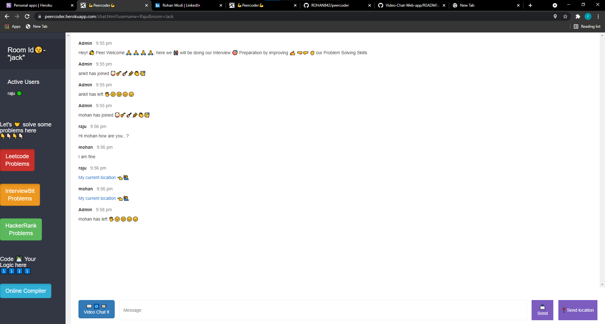

# [PEER CODER](https://shreyshreyansh.github.io/Peer-Coder-Web/) ⭐

&nbsp;
&nbsp;
&nbsp;
&nbsp;
&nbsp; 
&nbsp;
&nbsp;
&nbsp;

## Overview 👀

- **Real time code syncing among peers 👨‍💻**
- **Executes code in Java, Python, C++, C 💻**
- **Real time video and audio call 📹**
- **Clean UI ⚡**

